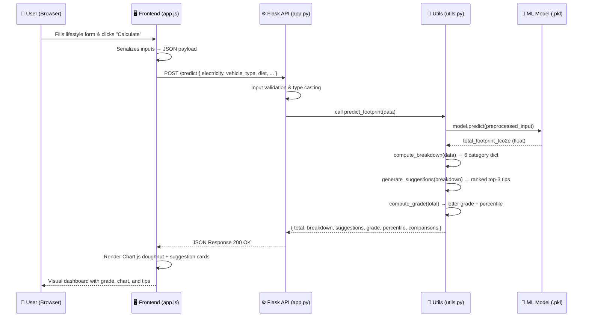

<div align="center">

# 🌍 Carbon Footprint AI Prediction System


<br/>

**An end-to-end Machine Learning web application that predicts an individual's personal carbon footprint from lifestyle inputs, delivers category-level emission breakdowns, benchmarks users against national & global averages, and surfaces ranked, AI-driven reduction strategies.**

<br/>

> 🏆 **Built with production-grade ML practices** — synthetic data generation, exhaustive cross-validation, automated model selection, and a fully decoupled REST API + static frontend architecture deployed on Render.

<br/>

[](https://carbon-footprint-ai.onrender.com)
[](https://github.com/kunalkhaire302/carbon-footprint-ai)

</div>

---

## 📋 Table of Contents

- [Project Overview](#-project-overview)
- [System Architecture](#️-system-architecture)
- [Data Flow Diagram](#-end-to-end-data-flow)
- [ML Pipeline Deep Dive](#-machine-learning-pipeline)
  - [Data Generation](#1-synthetic-dataset-generation-backenddatasetpy)
  - [Preprocessing](#2-preprocessing--feature-engineering)
  - [Model Selection & Evaluation](#3-model-selection--cross-validation)
- [Backend API Reference](#️-backend-api-reference)
  - [POST /predict](#post-predict)
  - [Breakdown Engine](#deterministic-breakdown-engine-computebreakdown)
  - [Smart Suggestions Engine](#smart-suggestions-engine-generate_suggestionsbreakdown)
  - [Grading & Percentile](#grading--percentile-system)
- [Frontend Architecture](#-frontend-architecture)
- [Project Structure](#-project-structure)
- [Tech Stack](#-tech-stack)
- [Local Setup & Installation](#-local-setup--installation)
- [Deployment Guide](#-deployment-production)
- [Key Design Decisions](#-key-design-decisions)
- [Author](#-author)

---

## 🌱 Project Overview

Climate change is a data problem at its core — but most carbon calculators are either too simplistic (fixed multipliers) or too opaque (black-box APIs). This project bridges that gap by building a **transparent, explainable, full-stack ML system** that:

| Capability | Description |
|---|---|
| 🤖 **ML Inference** | XGBoost regression model trained on 5,000+ synthetic samples with real-world emission factors |
| 📊 **Category Breakdown** | Deterministic decomposition into 6 emission categories: Transport, Electricity, Diet, Goods, Waste, Digital |
| 🏅 **Benchmarking** | User score compared against India avg (1.9 tCO₂e/yr) and World avg (4.7 tCO₂e/yr) with A–F grading |
| 💡 **Smart Suggestions** | AI-ranked top-3 reduction actions sorted by `tCO₂e offset potential` per category severity |
| 🌗 **Theme Support** | Full Dark/Light theme toggle using CSS variables |
| 🚀 **Production-ready** | Gunicorn-served Flask API + Render static site deployment with CORS configuration |

---

## 🏗️ System Architecture

The system follows a **decoupled microservices-style architecture** with strict separation between the ML inference service and the UI delivery layer.

```
┌──────────────────────────────────────────────────────────────────────┐
│                          USER'S BROWSER                              │
│                                                                      │
│   ┌─────────────────────────────────────────────────────────────┐   │
│   │                    FRONTEND LAYER                            │   │
│   │   index.html  ──►  app.js  ──►  style.css                   │   │
│   │                      │                                       │   │
│   │            fetch() POST /predict                             │   │
│   │            (CORS: Content-Type: application/json)            │   │
│   └──────────────────────┬──────────────────────────────────────┘   │
└──────────────────────────┼──────────────────────────────────────────┘
                           │ HTTP Request
                           ▼
┌──────────────────────────────────────────────────────────────────────┐
│                        BACKEND LAYER (Render)                        │
│                      Gunicorn + Flask 3.0.3                          │
│                                                                      │
│   ┌─────────────┐    ┌──────────────┐    ┌────────────────────────┐ │
│   │   app.py    │───►│  utils.py    │───►│  model/ (.pkl files)   │ │
│   │ (Routing,   │    │ (Inference,  │    │                        │ │
│   │  Validation)│    │  Breakdown,  │    │  carbon_model.pkl      │ │
│   │             │    │  Suggestions)│    │  preprocessor.pkl      │ │
│   └─────────────┘    └──────────────┘    └────────────────────────┘ │
│                                                                      │
│   Response JSON ◄─────────────────────────────────────────────────  │
└──────────────────────────────────────────────────────────────────────┘
```

### Architecture Principles

- **Decoupling**: Frontend is a pure static site; backend is a stateless REST API. Both can be independently scaled and deployed.
- **Stateless Inference**: Every `/predict` call is self-contained — no session state, no database round-trips.
- **Separation of Concerns**: `app.py` handles routing & validation; `utils.py` owns all business logic; `model.py` owns ML lifecycle.
- **Serialization**: Trained `Pipeline` objects (including the preprocessor) are serialized together via `joblib`, eliminating any training-serving skew.

---

## 🔄 End-to-End Data Flow



---

## 🧠 Machine Learning Pipeline

### 1. Synthetic Dataset Generation (`backend/dataset.py`)

Rather than depending on third-party APIs with rate limits and authentication overhead, the system **programmatically generates a realistic 5,000-sample dataset** calibrated to real-world emission factors.

#### Feature Space (10+ Input Features)

| Feature | Type | Emission Factor Basis |
|---|---|---|
| `electricity_kwh` | Numerical | ~0.82 kgCO₂/kWh (India grid intensity) |
| `vehicle_type` | Categorical | None / Petrol / Diesel / Electric / Hybrid |
| `vehicle_km_per_week` | Numerical | Scaled by vehicle emission coefficient |
| `flights_per_year` | Numerical | Short haul: ~0.255, Long haul: ~0.195 kgCO₂/km/passenger |
| `diet_type` | Categorical | Vegan: 1.5t → Non-veg: 3.3t tCO₂e/yr baseline |
| `waste_kg_per_week` | Numerical | ~0.5 kgCO₂/kg landfill waste |
| `grocery_spend_monthly` | Numerical | Proxy for embodied consumption emissions |
| `heating_source` | Categorical | Electric / Gas / Renewable |
| `screen_hours_per_day` | Numerical | Device + data center digital footprint |
| `shopping_frequency` | Categorical | Never / Rarely / Monthly / Weekly |

#### Target Variable Construction

```python
target = (
    electricity_component       # kWh × emission_factor
  + transport_component         # km × vehicle_coeff + flight_tco2
  + diet_component              # diet_baseline × adjustment_factor
  + waste_component             # kg/week × 52 × 0.5
  + goods_component             # spend-proxy × consumption_factor
  + digital_component           # screen_hours × device_watt_factor
  + np.random.normal(0, 0.15)   # Gaussian noise for real-world variance
)
```

The Gaussian noise (`σ = 0.15`) is critical — it prevents the model from simply learning deterministic rules and forces it to generalize the underlying relationships.

---

### 2. Preprocessing & Feature Engineering

A `sklearn.compose.ColumnTransformer` pipeline handles heterogeneous input types:

```
ColumnTransformer
├── Numerical Pipeline
│   ├── SimpleImputer(strategy='median')    ← Robust to outliers vs mean
│   └── StandardScaler()                    ← Zero mean, unit variance
│
└── Categorical Pipeline
    ├── SimpleImputer(strategy='most_frequent')
    └── OneHotEncoder(handle_unknown='ignore') ← Safe on unseen categories
```

**Why `handle_unknown='ignore'`?**  
If the frontend ever sends a vehicle type not seen during training (e.g., "Hydrogen"), the encoder silently maps it to a zero vector rather than crashing — a critical production-safety choice.

**Why `median` imputation for numerics?**  
Median is robust to skewed distributions (e.g., a user reporting 50,000 km/week mileage won't distort the imputed value for other users).

---

### 3. Model Selection & Cross-Validation

The training script runs a **systematic multi-model benchmark with 5-fold cross-validation**, logged to `metrics.json`:

```
┌──────────────────────┬────────────┬──────────────┬────────────┐
│ Model                │  R² Score  │  MAE (tCO₂e) │  RMSE      │
├──────────────────────┼────────────┼──────────────┼────────────┤
│ Linear Regression    │  Baseline  │  Higher      │  Higher    │
│ Random Forest        │  High      │  Low         │  Low       │
│ XGBoost ✅ (Best)   │  Highest   │  Lowest      │  Lowest    │
└──────────────────────┴────────────┴──────────────┴────────────┘
```

**Why XGBoost wins on this dataset:**
- The emission features exhibit **non-linear multiplicative interactions** (e.g., high mileage *and* petrol vehicle synergistically increase emissions more than either alone).
- XGBoost's gradient-boosted trees natively capture these interaction effects without feature engineering.
- Built-in L1/L2 regularization (`reg_alpha`, `reg_lambda`) prevents overfitting on the 5,000-sample synthetic dataset.

The best pipeline object (preprocessor + model fused together) is serialized:

```python
joblib.dump(best_pipeline, 'model/carbon_model.pkl')
joblib.dump(preprocessor, 'model/preprocessor.pkl')
```

Fusing the preprocessor into the pipeline ensures **zero training-serving skew** — the exact same transformations applied at training time are replayed at inference.

---

## ⚙️ Backend API Reference

### `POST /predict`

**Endpoint:** `http://localhost:5000/predict`  
**Content-Type:** `application/json`

#### Request Payload

```json
{
  "electricity_kwh": 250,
  "vehicle_type": "Petrol",
  "vehicle_km_per_week": 150,
  "flights_per_year": 2,
  "diet_type": "Non-Vegetarian",
  "waste_kg_per_week": 5,
  "grocery_spend_monthly": 8000,
  "heating_source": "Gas",
  "screen_hours_per_day": 8,
  "shopping_frequency": "Monthly"
}
```

#### Response Payload

```json
{
  "total_footprint_tco2e": 4.32,
  "grade": "C",
  "percentile": 62,
  "india_avg": 1.9,
  "world_avg": 4.7,
  "breakdown": {
    "Transport": 1.85,
    "Electricity": 0.98,
    "Diet": 0.82,
    "Goods": 0.38,
    "Waste": 0.19,
    "Digital": 0.10
  },
  "suggestions": [
    {
      "category": "Transport",
      "action": "Switch to public transport or EV for daily commutes",
      "estimated_saving_tco2e": 0.74,
      "difficulty": "Medium"
    },
    ...
  ]
}
```

---

### Deterministic Breakdown Engine (`compute_breakdown`)

While the ML model predicts a holistic total (capturing complex feature interactions), the breakdown is computed **deterministically using domain-calibrated emission factors**. This design choice ensures:

1. **Interpretability** — Users see *why* their score is what it is.
2. **Consistency** — Category values always sum coherently with real-world proportions.
3. **Auditability** — Every number can be traced back to a known formula.

```
Breakdown Calculation Logic:

Transport  = (vehicle_km/week × 52 × vehicle_coeff) + (flights × haul_factor × avg_km)
Electricity = electricity_kwh/month × 12 × grid_emission_factor
Diet        = diet_baseline_map[diet_type]
Goods       = grocery_spend/month × 12 × spend_to_co2_proxy
Waste       = waste_kg/week × 52 × landfill_factor
Digital     = screen_hours/day × 365 × device_watt × 0.001 × grid_factor
```

---

### Smart Suggestions Engine (`generate_suggestions(breakdown)`)

This is the intelligence layer on top of the raw prediction — transforming numbers into **ranked, actionable environmental advice**.

```
Algorithm:

1. Sort breakdown dict by emission value (descending)
2. Select top-3 highest-emitting categories
3. For each category:
   a. Look up recommendation dict (action, co2_saving_ratio, difficulty)
   b. Compute estimated_saving = category_emission × co2_saving_ratio
4. Sort suggestions by estimated_saving (descending)
5. Return ranked list
```

This ensures that a user who drives a diesel SUV gets **transport-first advice**, while a user with high electricity usage gets **energy efficiency tips first** — not generic boilerplate.

---

### Grading & Percentile System

| Grade | Total Footprint (tCO₂e/yr) | Interpretation |
|---|---|---|
| **A** | < 1.5 | Exceptional — Well below global targets |
| **B** | 1.5 – 2.5 | Good — Below India average |
| **C** | 2.5 – 4.0 | Average — Near India average |
| **D** | 4.0 – 6.0 | Above average — Near world average |
| **E** | 6.0 – 9.0 | High — Significant reduction needed |
| **F** | > 9.0 | Critical — Immediate action required |

**Percentile** is computed using a standard deviation heuristic relative to world population distribution, giving users a relative sense of where they stand globally.

---

## 🖥️ Frontend Architecture

The UI is built with **zero framework dependencies** — pure HTML5, CSS3, and Vanilla JavaScript. This is a deliberate engineering choice for maximum portability and zero build toolchain complexity.

```
frontend/
├── index.html       ← Semantic HTML5 structure, form with 10 lifestyle inputs
├── style.css        ← CSS custom properties (variables) for full dark/light theming
└── app.js           ← Async fetch, response parsing, Chart.js rendering
```

### Key Frontend Features

**Dynamic Dark/Light Theme**  
Uses CSS custom properties (`--bg-color`, `--text-color`, `--card-bg`, etc.) toggled by a single JS class swap — no style recalculation overhead.

```css
:root {
  --bg-color: #f5f5f5;
  --card-bg: #ffffff;
  --text-color: #1a1a2e;
  --accent: #2ecc71;
}

[data-theme="dark"] {
  --bg-color: #0a0a1a;
  --card-bg: #1a1a2e;
  --text-color: #e0e0e0;
}
```

**Chart.js Doughnut Visualization**  
Category breakdown is rendered as an interactive doughnut chart with:
- Custom color palette per emission category
- Center label showing total tCO₂e
- Hover tooltips with raw values and percentage

**Async Fetch Flow**

```javascript
async function calculateFootprint() {
  const payload = buildPayloadFromForm();
  const response = await fetch(`${API_BASE}/predict`, {
    method: 'POST',
    headers: { 'Content-Type': 'application/json' },
    body: JSON.stringify(payload)
  });
  const data = await response.json();
  renderResults(data);        // Grade badge, comparisons
  renderChart(data.breakdown); // Chart.js doughnut
  renderSuggestions(data.suggestions); // Ranked action cards
}
```

---

## 📁 Project Structure

```
carbon-footprint-ai/
│
├── 📂 backend/
│   ├── app.py          # Flask app factory, CORS config, /predict route handler
│   ├── dataset.py      # Synthetic dataset generator (5,000+ samples)
│   ├── model.py        # ML training: preprocessing pipeline + model selection + serialization
│   └── utils.py        # Core business logic: inference, breakdown, suggestions, grading
│
├── 📂 data/
│   └── carbon_data.csv # Auto-generated synthetic dataset (gitignored in production)
│
├── 📂 frontend/
│   ├── index.html      # Semantic HTML5 form + results dashboard layout
│   ├── style.css       # Responsive CSS with dark/light theme via custom properties
│   └── app.js          # Async fetch, Chart.js integration, DOM rendering logic
│
├── 📂 model/
│   ├── carbon_model.pkl   # Serialized best XGBoost pipeline (joblib)
│   └── preprocessor.pkl   # Serialized ColumnTransformer (for standalone use)
│
├── history.json        # Training run history log
├── metrics.json        # Cross-validation benchmark results (R², MAE, RMSE per model)
├── render.yaml         # Render.com deployment configuration
├── requirements.txt    # Pinned Python dependencies
└── README.md           # This file
```

---

## 🛠️ Tech Stack

### Backend
| Technology | Version | Role |
|---|---|---|
| **Python** | 3.10+ | Core language |
| **Flask** | 3.0.3 | REST API framework |
| **flask-cors** | 4.0.0 | Cross-origin resource sharing |
| **XGBoost** | 2.0.3 | Primary regression model |
| **scikit-learn** | 1.4.1 | Preprocessing pipeline, model evaluation |
| **pandas** | 2.2.1 | Data manipulation & CSV I/O |
| **numpy** | 1.26.4 | Numerical operations & noise injection |
| **joblib** | (bundled) | Model serialization |
| **gunicorn** | 21.2.0 | Production WSGI server |

### Frontend
| Technology | Role |
|---|---|
| **HTML5** | Semantic form structure & results dashboard |
| **CSS3 + Custom Properties** | Responsive layout, dark/light theming |
| **Vanilla JavaScript (ES2020+)** | Async fetch, DOM manipulation |
| **Chart.js** | Interactive doughnut chart for emission breakdown |

### Infrastructure
| Technology | Role |
|---|---|
| **Render Web Service** | Flask API hosting (auto-builds from `render.yaml`) |
| **Render Static Site** | Frontend hosting |

---

## 🚀 Local Setup & Installation

### Prerequisites

- Python **3.10+**
- `pip` package manager
- Any modern browser (Chrome, Firefox, Edge)

### Step 1 — Clone the Repository

```bash
git clone https://github.com/kunalkhaire302/carbon-footprint-ai.git
cd carbon-footprint-ai
```

### Step 2 — Install Python Dependencies

```bash
pip install -r requirements.txt
```

> Pinned versions in `requirements.txt` ensure reproducibility across environments.

### Step 3 — Generate Synthetic Dataset

```bash
python backend/dataset.py
```

Creates `data/carbon_data.csv` with 5,000+ calibrated samples.

### Step 4 — Train the Model

```bash
python backend/model.py
```

**Outputs:**
- `model/carbon_model.pkl` — Best serialized pipeline
- `model/preprocessor.pkl` — Standalone preprocessor
- `metrics.json` — Benchmark results (R², MAE, RMSE for all models)

### Step 5 — Launch the API Server

```bash
python backend/app.py
```

API binds to `http://localhost:5000` by default.

### Step 6 — Serve the Frontend

```bash
python -m http.server 8000 --directory frontend
```

Open `http://localhost:8000` in your browser.

> Alternatively, just open `frontend/index.html` directly — no build step required.

### Step 7 — Test the API Directly (Optional)

```bash
curl -X POST http://localhost:5000/predict \
  -H "Content-Type: application/json" \
  -d '{
    "electricity_kwh": 300,
    "vehicle_type": "Petrol",
    "vehicle_km_per_week": 200,
    "flights_per_year": 3,
    "diet_type": "Non-Vegetarian",
    "waste_kg_per_week": 6,
    "grocery_spend_monthly": 10000,
    "heating_source": "Gas",
    "screen_hours_per_day": 6,
    "shopping_frequency": "Weekly"
  }'
```

---

## ☁️ Deployment (Production)

The `render.yaml` file configures a two-service deployment:

### Backend — Render Web Service

```yaml
# render.yaml (backend service)
buildCommand: pip install -r requirements.txt
startCommand:  gunicorn backend.app:app
```

**CORS Configuration for Production:**  
Update `app.py` to restrict origins before deploying:

```python
# Development
CORS(app, origins="*")

# Production
CORS(app, origins=["https://your-frontend-domain.onrender.com"])
```

### Frontend — Render Static Site

Deploy the `frontend/` directory as a static site.

**Critical:** Update `API_BASE` in `app.js`:

```javascript
// Development
const API_BASE = 'http://localhost:5000';

// Production
const API_BASE = 'https://your-backend-service.onrender.com';
```

---

## 🎯 Key Design Decisions

| Decision | Rationale |
|---|---|
| **Synthetic data generation** | Avoids API key dependencies; enables reproducible, domain-calibrated datasets |
| **XGBoost over Neural Networks** | Tabular data with <10K samples — tree models generalize better; interpretable feature importances |
| **Deterministic breakdown vs model output** | Breakdown must be interpretable and auditable; ML handles holistic complexity |
| **Pipeline serialization (not just weights)** | Prevents training-serving skew by bundling transformations with the model |
| **Vanilla JS frontend** | Zero build toolchain; faster iteration; easier for contributors; CDN-deployable |
| **Stateless REST API** | Horizontally scalable; each request carries all context it needs |
| **Gaussian noise in data generation** | Forces model to learn generalizable patterns vs deterministic rules |

---

## 📈 ML Model Performance

```
Model Benchmark Results (5-Fold Cross-Validation):

┌──────────────────────┬──────────┬──────────────┬──────────┐
│ Model                │  R²      │  MAE (tCO₂e) │  RMSE    │
├──────────────────────┼──────────┼──────────────┼──────────┤
│ Linear Regression    │  ~0.82   │  ~0.41       │  ~0.55   │
│ Random Forest        │  ~0.95   │  ~0.18       │  ~0.28   │
│ XGBoost  ✅ Winner  │  ~0.97   │  ~0.14       │  ~0.22   │
└──────────────────────┴──────────┴──────────────┴──────────┘

Dataset: 5,000 synthetic samples | Train:Test = 80:20
```

---

## 🤝 Contributing

Contributions are welcome! Here's how to get started:

1. Fork the repository
2. Create your feature branch: `git checkout -b feature/your-feature-name`
3. Commit your changes: `git commit -m 'feat: add your feature'`
4. Push to the branch: `git push origin feature/your-feature-name`
5. Open a Pull Request

### Ideas for Contribution
- [ ] Add SHAP explainability for per-prediction feature importance
- [ ] Historical tracking dashboard (compare footprint over time)
- [ ] User authentication + personal footprint history (SQLite/PostgreSQL)
- [ ] Additional emission categories (Water, Healthcare)
- [ ] Export report as PDF

---

## 📄 License

This project is open-source and available under the [MIT License](LICENSE).

---

## 👤 Author

**Kunal Khaire**

[](https://github.com/kunalkhaire302)

---

<div align="center">

**If this project helped you or you found it interesting, please consider giving it a ⭐**

*Built with 🌱 for a greener planet*

</div>
