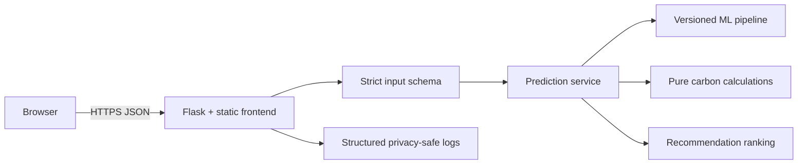
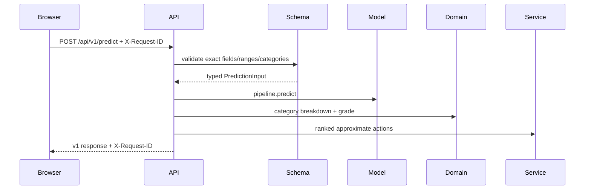

# Architecture

## System

The product is intentionally one deployable web service. Flask serves static files and `/api/v1`; Gunicorn supplies concurrent workers. The API is stateless and does not persist lifestyle inputs. A database, queue, and microservice split are omitted because no current requirement needs them.

## Boundaries

- `api`: HTTP methods, status codes, and versioned routes.
- `schemas`: untrusted input validation and API contracts.
- `services`: use-case orchestration.
- `domain`: pure factors, calculations, grading, and benchmarks.
- `ml`: validated, thread-safe model lifecycle.
- `middleware`: bounded per-process rate limiting and request policy.
- `frontend`: browser-local state, API client, accessible presentation.

## Inference flow

## Deployment

Render installs locked runtime dependencies and starts two Gunicorn workers with two threads each. `/ready` is the deployment health check. Startup loads and validates the artifact and metadata; readiness stays false if either fails.
